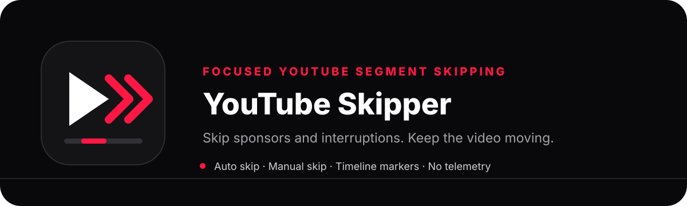

<p align="center">
  
</p>

<p align="center">
  <a href="https://github.com/Majkey25/yt-segments-sponsorship-autoskipper/releases/latest/download/yt-segments-sponsorship-autoskipper.zip">
    
  </a>
</p>

<p align="center">
  
  
  
  
</p>

<p align="center">
  A two-tab browser cleanup extension: YouTube Segments plus global AdGuard MV3 protection.
</p>

## Download

**[Download the latest extension ZIP](https://github.com/Majkey25/yt-segments-sponsorship-autoskipper/releases/latest/download/yt-segments-sponsorship-autoskipper.zip)**

> **Important:** use the ZIP from **Releases → Assets**. Do not use GitHub's automatically generated **Source code** ZIP and do not load the repository source folder directly in Chrome. Runtime bundles such as `adguard-content.js`, `adguard-assistant.js`, the generated filter catalog, and packaged AdGuard rules are created during the release build.

Chrome cannot install an unsigned ZIP directly. Extract it first, then load the extracted folder through Developer mode.

## Install in Chrome

1. Open the latest GitHub release.
2. Under **Assets**, download `yt-segments-sponsorship-autoskipper.zip`.
3. Extract it to a permanent folder.
4. Open `chrome://extensions`.
5. Enable **Developer mode**.
6. Click **Load unpacked**.
7. Select the extracted folder that directly contains `manifest.json`, `background.js`, and `adguard-content.js`.
8. Pin the extension from the Extensions menu.
9. Refresh open tabs.

## Two-tab control center

### YouTube Segments

The **YouTube Segments** tab contains the video-specific behavior:

- master segment skipping toggle,
- per-category **Auto skip**, **Show button**, and **Ignore** modes,
- timeline markers,
- skip notices,
- reset to safe defaults.

The UI uses product-owned names. Segment data is still provided by SponsorBlock and is credited in the popup, README, NOTICE, and source.

### AdGuard tab

The **AdGuard tab** is a browser-side control center for the capabilities exposed by `@adguard/api-mv3`:

- global protection on by default,
- optional **YouTube only** scope,
- current-site protection toggle backed by the allowlist,
- packaged filter list selection,
- loaded rule count and ruleset quota visibility,
- editable allowlist,
- editable custom user rules,
- AdGuard Assistant element blocker,
- bounded in-memory request log,
- engine start and stop diagnostics,
- current configuration state and sanitized diagnostics,
- document blocking page support for `$document` rules.

The build discovers the Chromium MV3 rulesets shipped by the current `@adguard/dnr-rulesets` package, declares up to Chrome's static ruleset manifest limit, and keeps a conservative recommended default set enabled. Filter selections are still subject to Chromium runtime rule and ruleset quotas.

## AdGuard controls

### Filters

The extension generates `filters/catalog.json` at build time from the packaged AdGuard Chromium MV3 rulesets. Available filters can include ad blocking, privacy and tracking, URL tracking, cookie notices, annoyances, security lists, mobile filters, language-specific filters, and other lists present in the upstream package.

The UI does not invent filters that were not packaged in the release.

### Allowlist

The allowlist accepts one domain per line. In **Global** scope, allowlisted domains are excluded from filtering. The popup can also allow or re-protect the current site with one click.

When the scope is **YouTube only**, the AdGuard API blocklist mode takes precedence, so global allowlist behavior is not active.

### User rules

The **User rules** editor accepts AdGuard filtering syntax and applies the rules through the AdGuard MV3 API. Previous settings remain intact if reconfiguration fails.

Manifest V3 restrictions still apply. The extension does not claim that arbitrary remote JavaScript can be executed.

### AdGuard Assistant

**Block element on this page** opens the AdGuard Assistant on the active HTTP or HTTPS page. Rules created by Assistant are appended to the user's custom rules and persisted only after the configuration applies successfully.

### Request log

The **Request log** shows blocked requests from the current browser session, including request URL, type, filter information when available, and AdGuard company category metadata when provided.

Duplicate AdGuard events are merged by request ID. The log is capped at 200 entries and is kept in memory rather than synced to browser storage.

### Document blocking page

Rules using the `$document` modifier can redirect to a local blocking page that displays the blocked destination, triggering rule, and filter ID. Query parameters are rendered as text, never as HTML. A user may explicitly allow the blocked site's hostname and continue.

## DNS boundary

This extension does **not** expose fake DNS settings. DNS-over-HTTPS, DNS-over-TLS, DNSCrypt, AdGuard DNS, AdGuard Home, parental control, and operating-system network controls are separate DNS or native-product features and are not part of `@adguard/api-mv3`.

For DNS-level filtering, use a separate DNS or native AdGuard product.

## Default segment behavior

| Category | Default |
| --- | --- |
| Sponsor | Auto skip |
| Self promotion | Auto skip |
| Interaction reminder | Show button |
| Intro | Show button |
| Outro / credits | Show button |
| Preview / recap | Show button |
| Hook | Show button |
| Non music | Show button |
| Filler | Ignore |

Filler remains ignored by default because it is an aggressive category and can remove content some users still want to watch.

## Privacy

Segment requests use SponsorBlock's privacy-preserving hash-prefix endpoint. The exact YouTube video ID is not sent as the API request path, and the extension keeps only the exact matching video from the returned candidates.

The AdGuard request log is session-only and bounded. No analytics or telemetry are added by this project.

## Permissions

| Permission | Why it is required |
| --- | --- |
| `storage` | Saves YouTube, AdGuard, filter, allowlist, custom rule, theme, and popup state. |
| `tabs` | Resolves the active page for Assistant and current-site controls. |
| `webRequest` | Enables AdGuard blocked-request events used by the request log. |
| `webNavigation` | Supports AdGuard scriptlet and navigation timing. |
| `unlimitedStorage` | Provides space for filtering assets and engine state. |
| `scripting` | Supports MV3 content filtering and Assistant injection. |
| `declarativeNetRequest` | Applies packaged network filtering rules. |
| `declarativeNetRequestFeedback` | Lets the AdGuard runtime observe DNR outcomes where the browser permits it. |
| `<all_urls>` host access | Required for default global AdGuard filtering. |

## Updating an unpacked install

GitHub Releases cannot silently update an extension installed with **Load unpacked**.

1. Download the newest release ZIP.
2. Replace the files in your existing extension folder.
3. Open `chrome://extensions`.
4. Click the reload button on the extension card.

## Development

Requires Node.js 22 or newer.

```bash
npm install
npm test
npm run build
npm run package
```

The unpacked extension is generated in `dist/extension/` and release ZIPs are generated in `dist/release/`.

## Tests

The Node test suite covers settings migration, segment parsing, AdGuard configuration, allowlist normalization, request-log deduplication, filter catalog validation, two-tab popup contracts, Assistant and blocking-page packaging, manifest scope, and release metadata.

## Releases and filter refresh

GitHub Actions runs tests, builds fresh AdGuard DNR assets, packages the extension, verifies the archive root, and publishes both stable and versioned release ZIPs. The release workflow also refreshes packaged filter assets on schedule.

## Attribution

SponsorBlock provides the crowdsourced YouTube segment API. AdGuard provides the MV3 filtering engine, ruleset tooling, Assistant, and filtering assets. See [NOTICE.md](NOTICE.md) for third-party notices.

This project is independent and is not affiliated with YouTube, Google, SponsorBlock, or AdGuard.

## License

Licensed under **GPL-3.0-only**. The GPL license is used because the distributed filtering build incorporates GPL-licensed AdGuard components and assets.
