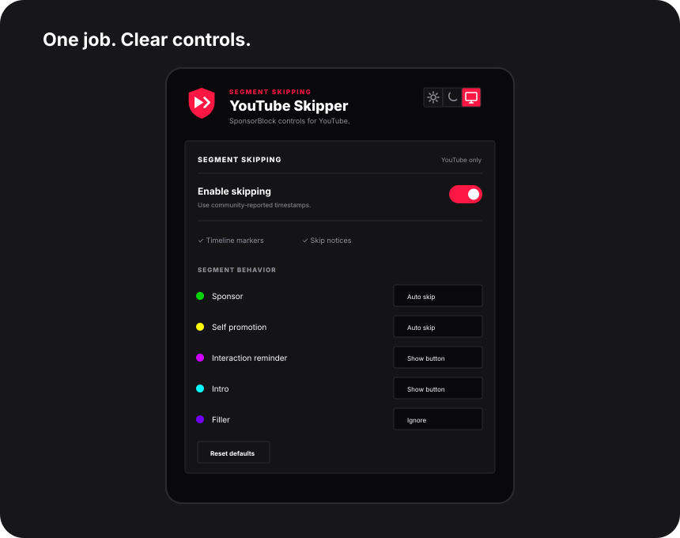

<p align="center">
  
</p>

<p align="center">
  <a href="https://github.com/Majkey25/yt-segments-sponsorship-autoskipper/releases/latest/download/yt-segments-sponsorship-autoskipper.zip">
    
  </a>
</p>

<p align="center">
  
  
  
  
</p>

<p align="center">
  Skip sponsored video segments and other interruptions, then block YouTube ads with a focused Manifest V3 ad-blocking engine.
</p>

## Download

**[Download the latest extension ZIP](https://github.com/Majkey25/yt-segments-sponsorship-autoskipper/releases/latest/download/yt-segments-sponsorship-autoskipper.zip)**

> **Important:** use the ZIP from **Releases → Assets**. Do not use GitHub's automatically generated **Source code** ZIP and do not load the repository source folder directly in Chrome. The AdGuard runtime, filter rules, and files such as `adguard-content.js` are generated during the release build and exist only in the built extension.

Chrome cannot install an unsigned ZIP directly. Extract it first, then load the extracted folder through Developer mode.

## Install in Chrome

1. Open the latest GitHub release.
2. Under **Assets**, download `yt-segments-sponsorship-autoskipper.zip`.
3. Extract it to a permanent folder.
4. Open `chrome://extensions`.
5. Enable **Developer mode**.
6. Click **Load unpacked**.
7. Select the extracted folder that directly contains `manifest.json` and `adguard-content.js`.
8. Pin **YT Segments & Sponsor Autoskipper** from the Extensions menu.
9. Refresh any open YouTube tabs.

## Features

- Auto-skip SponsorBlock sponsor segments.
- Per-category behavior: **Auto skip**, **Show button**, or **Ignore**.
- Supports sponsor, self-promotion, interaction, intro, outro, preview, hook, non-music, and filler segments.
- Colored segment markers on the YouTube seek bar.
- YouTube-style manual skip button for categories you do not want skipped automatically.
- YouTube-only ad blocking using the AdGuard Base filter and AdGuard MV3 engine.
- Dark, light, and system popup themes.
- No analytics, telemetry, accounts, advertisements, or remote executable code.
- Automated release builds refresh the bundled AdGuard rules from the upstream package.

<p align="center">
  
</p>

## Default segment behavior

| Category | Default |
| --- | --- |
| Sponsor | Auto skip |
| Self promotion | Auto skip |
| Interaction reminder | Show button |
| Intro | Show button |
| Outro / credits | Show button |
| Preview / recap | Show button |
| Hook | Show button |
| Non music | Show button |
| Filler | Ignore |

Filler is intentionally ignored by default because it is an aggressive category and can remove content some users still want to watch.

## How ad blocking works

The extension does not contain a home-made list of YouTube ad URLs. At build time it uses the official AdGuard MV3 tooling and **AdGuard Base filter**. The filtering engine is configured with a YouTube-only blocklist, so the ad blocker is not intended to modify unrelated websites.

Manifest V3 does not allow an extension to silently download and execute new filtering code. To keep the packaged rules fresh, GitHub Actions rebuilds the release with the newest `@adguard/dnr-rulesets` assets on a schedule.

There is no honest way to promise that an ad blocker will work forever. YouTube and browser extension APIs change. The automated upstream refresh is designed to reduce maintenance lag, not pretend maintenance is unnecessary.

### Updating an unpacked install

GitHub Releases cannot silently update an extension installed with **Load unpacked**.

1. Download the newest release ZIP.
2. Replace the files in your existing extension folder.
3. Open `chrome://extensions`.
4. Click the reload button on the extension card.

Automatic browser-level updates require distribution through a browser extension store or managed enterprise deployment.

## SponsorBlock privacy

SponsorBlock requests use the privacy-preserving hash-prefix endpoint. The exact YouTube video ID is not sent as the API request path. The API response contains candidates sharing the prefix, and the extension keeps only the exact matching video locally.

## Permissions

| Permission | Why it is required |
| --- | --- |
| `storage` | Saves segment, ad-block, and theme settings. |
| `tabs` | Supports the AdGuard MV3 filtering runtime. |
| `webRequest` | Supports cosmetic filtering and request-aware AdGuard behavior. |
| `webNavigation` | Lets the filtering engine apply scriptlets at the correct navigation stage. |
| `unlimitedStorage` | Gives the filter engine enough storage for filtering assets and state. |
| `scripting` | Supports MV3 content filtering. |
| `declarativeNetRequest` | Applies packaged network filtering rules. |
| `declarativeNetRequestFeedback` | Lets the AdGuard runtime inspect declarative rule results while developing/unpacked. |
| `<all_urls>` host access | Required by Chromium network filtering for cross-origin ad requests. The engine itself is configured to operate only on YouTube domains. |

The broad host permission is the ugly part. Hiding that would be dishonest. Ad blocking can involve requests to many third-party hosts even when the page itself is YouTube.

## Development

Requires Node.js 22 or newer.

```bash
npm install
npm test
npm run build
```

The unpacked extension is generated in:

```text
dist/extension/
```

To create release ZIPs locally:

```bash
npm run package
```

## Tests

The Node test suite covers:

- YouTube video ID extraction.
- SponsorBlock segment validation and sorting.
- Settings validation.
- SponsorBlock privacy hash-prefix request generation.
- Exact-video response filtering.
- AdGuard YouTube-only configuration.
- Manifest and release project contracts.

## Releases and filter refresh

GitHub Actions performs the same release pattern as `tab-copy-extension`:

- run tests,
- build a fresh MV3 extension,
- fetch current AdGuard DNR assets,
- verify `manifest.json` is at the archive root,
- publish `yt-segments-sponsorship-autoskipper.zip`,
- publish `yt-segments-sponsorship-autoskipper-vX.Y.Z.zip`.

The workflow also runs every day so the downloadable release can receive refreshed AdGuard filter assets even when application code has not changed.

## Project structure

```text
.
├── .github/workflows/
├── assets/
├── icons/
├── lib/
├── scripts/
├── src/
├── tests/
├── CONTRIBUTING.md
├── LICENSE
├── NOTICE.md
├── RELEASE_NOTES.md
├── manifest.json
├── content.js
├── popup.css
├── popup.html
└── popup.js
```

## Attribution

SponsorBlock provides the crowdsourced segment API. AdGuard provides the MV3 filtering engine, ruleset tooling, and filtering assets. See [NOTICE.md](NOTICE.md) for third-party notices.

This project is independent and is not affiliated with YouTube, Google, SponsorBlock, or AdGuard.

## License

Licensed under **GPL-3.0-only**. The GPL license is used because the distributed ad-blocking build incorporates GPL-licensed AdGuard components and filtering assets.
